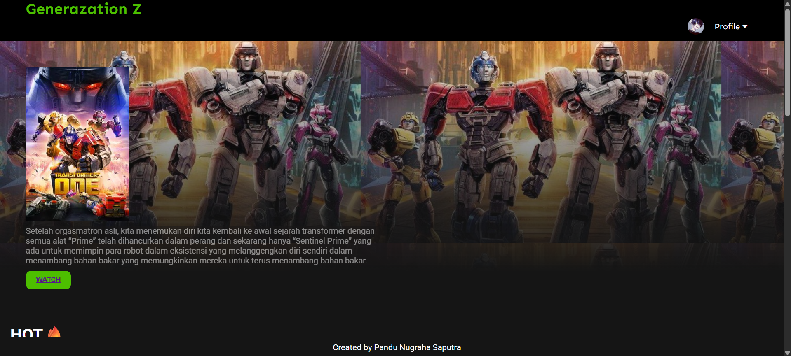
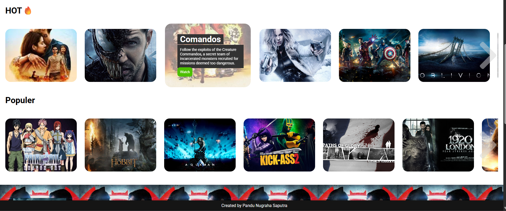
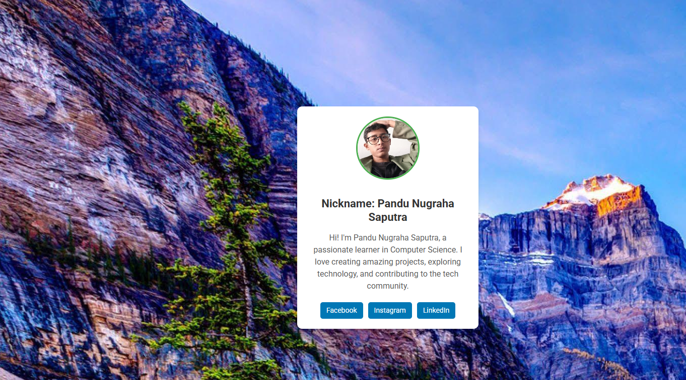
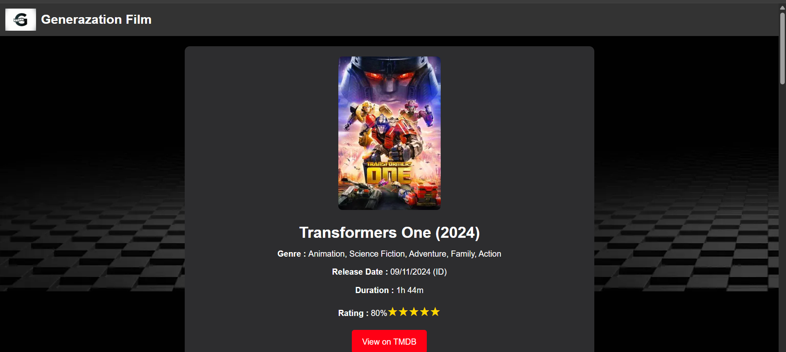

# 🎬 Gen Z Movie Platform
GenZ Movie Platform adalah sebuah aplikasiWebsite cinema platform sederhana yang memungkinkan pengguna menjelajahi dan mencari film populer. Tujuan utama proyek ini adalah memberikan pengalaman antarmuka pengguna yang responsif dan menarik untuk menampilkan data film
  
## ✨ Fitur Utama
- Tampilan antarmuka modern dengan navigasi yang mudah.
- Daftar film dengan efek hover interaktif.
- Mode terang dan gelap (dengan toggle switch).
- Responsif untuk berbagai ukuran layar (desktop & mobile).
- Drop-down menu profil untuk akses cepat.

## Tech
Aplikasi ini dibangun dengan menggunakan :
- HTML5 – Struktur dasar halaman.
- CSS3 – Styling dan efek visual responsif.
- JavaScript (Vanilla JS) – Logika interaktif seperti toggle mode dan efek klik.

## 📸 Preview

Berikut adalah tangkapan layar dari struktur folder proyek:
### 📁 Struktur Proyek
```
📁 GenZ-MoviePlatform/
├── img/
│ └── home1,2,3dst.jpg
|── img1/
│ └── m1,m2,3dst.jpg
│── PageTransformers/
│ ├── Source Code_PageTransformer1.css
│ └── Source Code_PageTransformer2.css
│
├── Profile/
│ ├── profile.html
│ └── style.css
│ └── FIKS2.jpg
├── index.html
├── app.js
├── style.css
```

### 📸 Preview





## 🧑‍💻 Kontribusi
Kontribusi sangat terbuka! Silakan fork repo ini dan ajukan pull request jika kamu ingin menambahkan fitur baru atau meningkatkan tampilan.

## 🚀 Cara Menjalankan
1.Clone repo ini
```
git clone https://github.com/your-username/genz-movie-platform.git
cd genz-movie-platform
```
2.Buka index.html di browser
3.Tidak diperlukan instalasi tambahan karena ini proyek front-end murni.

## 📱 Responsivitas
- Desain menyesuaikan dengan layar perangkat menggunakan media queries.
- Menu dropdown dan elemen-elemen menyusut atau disembunyikan sesuai ukuran layar.

## 👌 Kontributor

Pandu Nugraha Saputra – Front-End Developer

🎥 Selamat menikmati Gen Z Movie Platform! Proyek kecil untuk pengalaman film yang menyenangkan.

## 📄 Lisensi

Proyek ini dirilis di bawah lisensi MIT.Silakan digunakan, dimodifikasi, dan disebarluaskan dengan tetap mencantumkan kredit.
